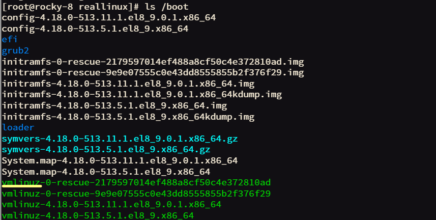

Linux의 역할 및 목적, 각 기능별 매커니즘 등 굉장히 이론적인 부분에 많이 접근할 수 있었던 기간.

  

# 🤔 리눅스의 역할
단 한 번도 생각해본 적 없는 부분. 그래서 더 알 필요가 있다.
  

***1. App 관리***  
카톡, 크롬 등 우리가사용하는 다양한 유저 프로그램(Application) 관리

***2. HW 관리***  
CPU, RAM(memory), DISK, NET 등 관리

리눅스는 아래와 같은 흐름으로 동작한다. 
> **코드 ⇒ 함수(기능): 실행
리눅스 ⇒ C언어 ⇒ 함수들을 실행하여 구동 ⇒ 컴파일 과정에서 압축 ⇒ * vmlinuz***

 

그렇다면 다시. 함수들이 왜 있는가?
APP 관리 & HW 관리를 위한 동작 수행을 위해서!! 
즉, 리눅스의 역할은 목적이된다^v^

나중에 더 자세히 정리할 거지만 너무 기본이자 중요한 내용이라 미리 언급하겠다.  

가상 매커니즘 참조하는 간접 액세스 방식을 활용한다. 
ex. VPN으로 IP 주소 우회, 중국집 다이렉트 주문이 아닌 배달앱을 활용한 중국집 음식 주문 등  
vm(virtual memory) 이 컴파일, OS 운영 등에 영향을 미친다.
그리고 깡통 주소를 활용(LAZY)한다고 해서 이를 ***후매핑*** 이라고 한다. 
   

# 🧺 리눅스 구성
소스 코드를 기준으로 3가지로 나눌 수 있다. 

이 3가지는? 
➡️ linux의 역할 수행을 위해 구성되었다.
 

## 1. core 파트
여기서도 3가지로 나뉜다..^^

### 1. 1. PM (Process Management)
- memory를 공유하며 운용되는 task들을 쓰레드로 관리
- ***CPU 자원*** 을 나누어 공유하며 관리
- task 단위로 관리

### 1. 2. MM (Memory Management)
- 가상 메모리(vm)을 중개하며 전달
- LAZY 매핑하여 제공
- ***RAM 자원*** 을 나누어 공유하고 관리 
    물리메모리 / 가상메모리 관리
- memory를 분할하여 관리
- 분할 조각 = page
 

> ***메모리 조각*** 
> page = 4KB 
> = 4096, 0x1000, 2^12, 12 bit 
>  ***📢성능고도화 작업에서 크기 고려는 매우 중요하다‼***

### 1. 3. 인터럽트, 예외처리
인터럽트, 예외처리 ⇒ ***Entry*** 
커널 함수의 진입점을 지나게 된다.

- main 함수에서 시작(절차지향 x)
- GUI ⬇️

> <U>***_리눅스 커널은 "이벤트 핸들러"_***</U>
동작하던 것들을 잠시 중지하고 이벤트 처리
1. CPU 내부에서 발생하는 타이머 인터럽트(hw, 전기적 신호)
2. CPU 외부에서 발생하는 net 인터럽트

여기서 예외처리는 프로그래밍의 예외처리가 아니다!! 
<U> ***syscall, pagefault***  ***(자주 발생하는 exception)***</U>

이런 exception을 처리하는 이유?  ➡️ 커널은 이벤트 핸들러이기 때문!  

***syscall***
- MySQL이 DISK 사용을 희망할 때 직접 터치하는 것이 아니라 리눅스에 요청하는 것. 이런 방식이 시스템콜^^
- 크롬이 NET 사용을 희망 -> 리눅스에 요청
- 유저가 HW 자원을 사용하기 위해 <U>커널에 요청하는 것</U>
 

***syscall(open, read, write)***
- file만을 다루는 것이 아님
- 다루는 기준이 엑세스, NET일 수도 있다
- 리눅스에는 이미 HW 관리 함수(=리눅스 역할)가 내장되어 있어 open, read, write만 해주면 사용가능!!

 

***pagefault***
- 깡통주소일 때 발생하는 이벤트
- 후매핑
- LAZY여서 바로 실행되지 않음
- 그래서인지 kill 기능도 있음

 

## 2. I/O 파트
### 2. 1. NETWORK
- L4(TCP): port(사이트가 아니라 서버가 사용함 주의!!)
- L3(IP)
- L2(DD): MAC주소(=컴퓨터 주소)
- L7? ➡️ 커널 역할 밖..ㅎㅎ

### 2. 2. DISK
- VFS(Virtual File System): "가상 자원들을 file처럼 다루겠다"
    - syscall을 기반으로 구동 됨
    - ***syscall=리눅스의 인터페이스(자원 요청할 때 사용)***
- FS
- Block

### 2. 3. 디바이스
- NET CARD(= 칩), USB, Bluetooth

 

## 3. 기타 ..^^
- 보안, 사운드, 도구(추적/디버깅/성능 등)
- 사실 앞 내용에 비해 그렇~게 중요하진 않음..ㅎㅎ
