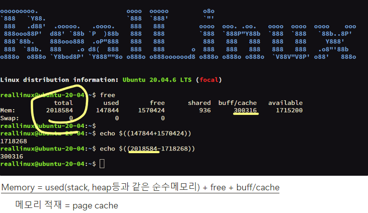

리눅스의 디렉토리, 파일에 대한 공부 내용 정리.

   

# 📂 리눅스 디렉토리
우선, 리눅스 다룰 때 기본이자 가장 중요한 두 가지가 있다. 
1. `whoami`  _내가 누군지_
2. `pwd`   _내가 어디 있는지_

디렉토리 파트에서는 2번. 내가 어느 경로에서 작업중인지를 잘 알아야 한다. 
같은 명령어도 위치에 따라 전혀 다르게 동작하기 때문이다.

내 위치를 아는 것의 중요성을 강조했으니, 이제 리눅스 디렉토리에 대해 설명하겠다.

 

| /etc | 설정파일이 들어있는 폴더 |
| --- | --- |
| /bin | 바이너리파일(실행파일) 폴더 |
| /sbin | 시스템 관리자 전용 바이너리파일(실행파일) 폴더 net, disk는 superuser 권한이 필요함 → 시스템 관리자 권한 |
| /usr | apt, dnf, yum 같은 패키지 관리자를 통해 설치하는 주요 폴더 배포판 종류마다 주요 매커니즘은 비슷하나, usr 밑 목록에 차이가 있다. |
| /usr/bin |  |
| /usr/sbin |  |
| /usr/local/ | 소스코드 → 컴파일 ⇒ 직접 설치하는 전용 폴더 |
| /usr/local/bin |  |
| /usr/local/sbin |  |

 

etc 설정파일, bin 바이너리, sbin 시스템 관리자용 바이너리 
위 3가지는 무. 조. 건. 암기해야 한다.

보면 bin, sbin이 가지각곳에 다 존재한다.  
그러나, 다 같은 기능이지만 다 같은 디렉토리라고 할 수는 없다(?) 
아까 말했듯이, 위치에 따라 명령어 결과가 다르기 때문에!

    

# 📎 파일 타입과 세부정보 확인하기
 

## 파일 정보 확인하기
>***`file [file name]`***

명령어 `file`은 파일의 타입을 출력한다. 

예를 들어, hello.txt라는 텍스트 파일의 정보를 확인한다면  
`hello.txt: ASCII text`
  
/dev/vad의 정보를 확인한다면  
`/dev/vda: block special (252/0)` 와 같이 출력된다는 말씀!
  

file 명령어는 단순한 파일 종류만을 출력해준다. 
더 세부적인 정보를 원한다면 다른 명령어를 사용해야 한다.
  

>***`stat [file name]`***

명령어 `stat`는 아래와 같이 출력된다. 

- 파일의 정보를 저장하는 자료구조 명칭 ➡️ ***아이노드(inode)*** 
- 1 file = 1 inode
- file 구분 = inode 번호
- 같은 파일도 여러 디렉토리에 존재할 수 있어 파일명만으로는 구분이 어렵다. 따라서 ***아이노드 번호를 통해 같은 이름의 파일을 식별***
- 따라서, _<U>***stat는 아이노드를 보는 것***_</U> 과 같은 명령어다!
- 📢 파일 정보 != 파일 내용 주의!!!

  

나중에 더 자세히 설명할 거지만, DISK에는 3가지의 물리블록이 존재한다. 이 3가지로 정보를 나누어 저장한다고 이해하면 된다.   

1. 슈퍼블록
    - 파일 시스템 정보가 들어있음
    - 파일 시스템: 물리블록들을 어떻게 read/write할지에 대한 전략, 규칙
2. 아이노드블록
    - stat
3. 데이터블록

  

# 파일의 read / write
***Bufferd I/O***

Memory = used + free + buff/cache 
메모리 적재 -> page cache라고 칭함 
 

avaliable = 유저가 사용할 수 있는 메모리 양  
=(free - 시스템 예약 메모리) + (털어낼 수 있는)buff/cache 
free라고 해서 전부 다 유저가 사용할 수 있는 것은 아님을 주의!!  
 

### write 순서
1. 페이지 캐시 준비
2. 유저 데이터 복사
3. 페이지 캐시 Dirty 표시

### read 순서
1. 페이지 캐시 탐색 
    1.1. Hit: 페이지 캐시 read  
    1.2. Miss: 페이지 캐시 준비(Blocking I/O)  
        - 디스크 I/O 요청 ➡️ sleep  
        - 디스크 I/O 완료 ➡️ wake up

    

# 🔗 링크(In) 생성과 심볼릭(바로가기) 링크
- 파일 or 디렉토리를 기준으로 생성 가능!

 

## 링크(In) 생성

`ln -s hello.txt h.txt` 
화살표로 파일을 가리키는 저 h.txt가 바로 링크 파일이다.

 

링크 파일을 수정하면 원본 또한 수정된다! 
반대로 원본을 수정해도 원본을 가리키는 링크 파일에도 반영된다.  
 

***원본 파일을 지우면?***

캡처본이라 안나오지만 지워진 원본(hello.txt)가 빨간색으로 깜빡깜빡거리는 걸 확인할 수 있다! 
이때 hello.txt라는 동일한 이름의 새 파일을 생성해주면 h.txt또한 실행된다. 
 

디렉토리 링크도 가능하다.

 

## 심볼릭(바로가기)

`ln -s usr/bin/ bin` 

홈 디렉토리의 bin을 심볼릭 디렉토리로 만드려고 햇는데 해당 파일 밑에 bin 이름의 심볼릭 디렉토리가 생겼다.  
bin을 심볼릭 디렉토리로 덮어쓰기 되지 않고, 하위에 생성 됐다.  
 
bin을 위치로 파악하고 하위에 링크가 생성된 것은 무엇때문일까?
 
그리고 usr/bin/이 에러 처리되어 있다.  
**➡️ bin 기준 usr/bin의 경로가 존재하지 않기 때문! 
➡️따라서, bin 링크의 원본이 없다는 알림이 뜨는 것이다.**  
 

***해결*** 

`rm -rf bin` 명령어로 bin을 지우고, 다시 `ln -s /usr/bin/ bin`을 실행해줬다.  그러니, 우리가 바란대로 실행된 것을 확인! 
 

또 다른 방법으로는 심볼릭 링크를 상대가 아닌 절대 경로로 만드는 것(?)이 있겠다. 
위 문제는 **현재 위치 기준** 경로가 존재하지 않아 발생한 것으로, 절대 경로로 지정하면 위 문제를 조금 예방할 수 있겠다.   
**⚠️대신 문제가 아예 없는 것은 아니다!!** 
만일 압축 후 다른 곳에서 압축을 풀었을 때 절대 경로 또한 일치하지 않아 위와 같은 경로 문제가 발생할 수 있다..!  
 

***또 다른 문제***

위 내용과 이어진다. 
심볼릭 디렉토리 bin 밑에 temp_bin 파일을 생성했다.  
그러자, 원본 usr/bin 밑에도 temp_bin이 생긴 것을 확인할 수 있었다..! 
왜 이럴까? ➡️ 바로 **심볼릭 링크 디렉토리 밑에 파일을 생성했기 때문!!**
 
아까 링크 파일때도 그러했듯이 링크 파일/심볼릭 디렉토리에 변화가 생기면 원본에도 반영된다.
