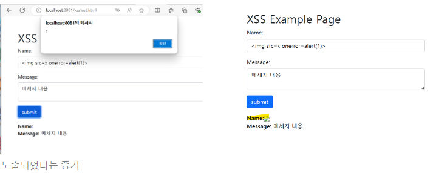

XSS, SQL Injection 등

<br><br><br>
# 웹 해킹은?
### Buffer Overflow
- 제한 크기 이상일 때 발생한다.<br>
- **정해진 버퍼를 벗어나 다른 영역을 덮어쓰는 비정상적인 현상**
- 악의적인 비정상적인 코드 실행 위험!

<br><br><br>

# XSS
- 악의적인 스크립트로 공격하여 원하는 정보를 취득하거나 공격을 가할 수 있는 해킹 기법
- input값이 외부에 노출될 위험!
- Cross의 c가 css 언어와 충돌하여 xss라는 약어를 사용!
<br>

노출되었다는 증거는 alert로도 충분히 확인 가능하다.

<br>

<br><br><br>

# SQL Injection
- 특정 sql 쿼리문을 전송하여 공격자가 원하는 정보를 DB로부터 가져오는 해킹 기법
<br><br>

<예시코드>
```php

<?php
    include "./config.php";
    $con = con();
    if(preg_match('/lecture|_|\.|\(\)|or|and/i', $_GET['id'])) exit("Detected!");
    if(preg_match('/lecture|_|\.|\(\)|or|and/i', $_GET['password'])) exit("Detected!");
    $sql = "SELECT id FROM users WHERE id='{$_GET['id']}' AND password='{$_GET['password']}'";
    echo "<h1>Query : <strong>{$sql}</strong></h1><br><br><br>";
    $result = @mysqli_fetch_array(mysqli_query($con,$sql));
    if($result['id'] == 'admin')
    {
        solve();
    }
    highlight_file(__FILE__);
?>
```
**정답**<br>
ip/index.php?id=admin' -- -&pw=''
<br>

